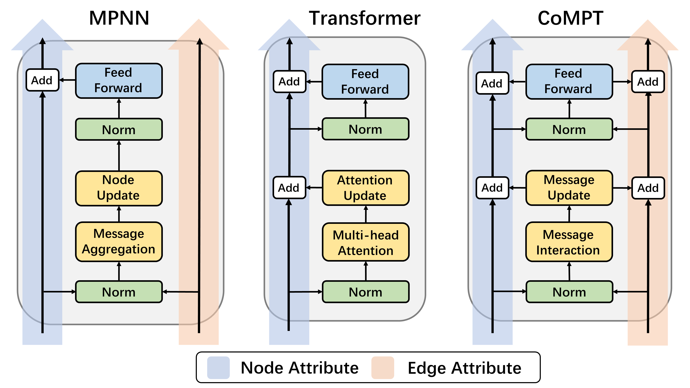

# CoMPT

Reimplementation of the CoMPT model by using pytorch.

The original implementation of CoMPT could be referred at [CoMPT](https://github.com/jcchan23/CoMPT).

The IJCAI 2020 paper could be referred at [Learning Attributed Graph Representation with Communicative Message Passing Transformer](https://www.ijcai.org/proceedings/2021/0309.pdf).



## Dependencies
+ cuda == 10.2
+ cudnn == 7.6.5
+ einops == 0.4.0
+ numpy == 1.19.1
+ pandas == 1.1.0
+ python == 3.7.7
+ RDKit == 2020.03.4
+ scikit-learn == 0.23.2
+ torch == 1.8.1
+ tqdm == 4.48.2

## Overview

*1. Result on Graph-level dataset*

This result could be refered from [GROVER](https://arxiv.org/pdf/2007.02835.pdf), [MPG](https://arxiv.org/pdf/2012.11175.pdf),  [CoMPT](https://www.ijcai.org/proceedings/2021/0309.pdf) and [KCL](https://arxiv.org/pdf/2112.00544.pdf). Thanks a lot for their working! 

| Dataset | BBBP | Tox21 | Toxcast | Sider | ClinTox | ESOL | FreeSolv | Lipophilicity |
|:---:    |:---: |:---:  |:---:    |:---:  |:---:    |:---: |:---:     |:---:          |
|Molecules|2039  |7831   |8575     |1427   |1478     |1128  |642       |4200           |
|Task     |1 GC  |12 GC  |617 GC   |27 GC  |2 GC     |1 GR  |1 GR      |1 GR           |
|Metrics  |AUROC |AUROC  |AUROC    |AUROC  |AUROC    |RMSE  |RMSE      |RMSE           |
|GCN      |0.877±0.036|0.772±0.041|0.650±0.025|0.593±0.034|0.845±0.051|1.068±0.050|2.900±0.135|0.712±0.049|
|MPNN     |0.913±0.041|0.808±0.024|0.691±0.013|0.595±0.030|0.879±0.054|1.167±0.430|2.185±0.952|0.672±0.051|
|DMPNN    |0.919±0.030|0.826±0.023|0.718±0.011|0.632±0.023|0.897±0.040|0.980±0.258|2.177±0.914|0.653±0.046|
|CMPNN    |0.927±0.017|0.806±0.016|0.738±0.010|0.616±0.003|0.902±0.008|0.798±0.112|2.007±0.442|0.614±0.029|
|GROVER   |0.911±0.008|0.803±0.020|0.721±0.009|0.624±0.006|0.884±0.013|0.911±0.116|1.987±0.072|0.643±0.030|
|CoMPT    |0.938±0.021|0.809±0.014|0.740±0.013|0.634±0.030|0.934±0.019|0.774±0.058|1.855±0.578|0.592±0.048|
|CoMPT-re |0.951±0.017|0.796±0.007|0.725±0.008|0.626±0.017|0.904±0.021|0.832±0.147|1.948±0.471|0.616±0.019|

*2. Result on Node-level dataset*

This result could be refer from [GCN](https://jcheminf.biomedcentral.com/articles/10.1186/s13321-019-0374-3) and [MPNN](https://pubs.acs.org/doi/10.1021/acs.jcim.0c00195). Thanks a lot for their working!

| Dataset | 1H-NMR | 13C-NMR |
|:---:    |:---: |:---:  |
|Molecules|12800  |26859   |
|Task     |1 NR  |1 NR  |
|Metrics  |MAE |MAE  |
|HOSE     |0.33|2.85|
|GCN      |0.28|1.43|
|MPNN     |0.229±0.002|1.355±0.022|
|CoMPT    |0.214±0.003|1.321±0.012|
|CoMPT-re |0.220±0.003|1.336±0.020|


*3. Some hyper-parameters*

| Dataset | BBBP | Tox21 | Toxcast | Sider | ClinTox | ESOL | FreeSolv | Lipophilicity | 1H-NMR | 13C-NMR |
|:---:    |:---: |:---:  |:---:    |:---:  |:---:    |:---: |:---:     |:---:          |:---:   |:---:    |
|max_epochs|30|30|30|30|30|50|50|50|150|150|
|batch_size|16|16|16|2|8|4|4|8|32|32|
|hidden_features_dim|128|256|256|256|256|128|128|256|256|256|
|num_MHSA_layers|2|3|3|2|2|1|2|3|6|6|
|num_attention_heads|4|4|4|4|4|4|4|4|4|4|
|num_FFN_layers|1|2|2|2|2|2|2|2|2|2|
|num_Generator_layers|2|2|2|2|2|2|2|2|3|3|
|dropout|0.2|0.2|0.2|0.1|0.0|0.0|0.0|0.0|0.1|0.1|
|scale_norm|False|False|False|False|False|True|True|False|True|True|

*Note:*

*(1) GC=Graph Classification, GR=Graph Regression, NR=Node Regression*

*(2) All models are trained without using non-label pretrain data.*

*(3) I guess the worse performance in the reimplementation may be the preprocess node and the edge features, the second reason may be due to the remove of some residual connection.*

*(4) The chemical shift prediction may be no need of edge hidden update, you can refer the line 271 for `model_graph.py` and `model_node.py`, otherwise will affect the final performance.*

*(5) I have tried to add the gru layer in the pooling module and found the performance of chemical shift prediction drop a lot, while this layer will increase the protein binding site prediction(A CoMPT version optimized by protein), so there will be more works on it.*

## Running

To reproduce all the results, run firstly:

`python dataset_<graph/node>.py`

it will generate a pickle file in the `data/preprocess` with the same dataset name, this pickle file contain 4 objects:

+ `smiles_list:` All SMILES strings in the dataset.
+ `mols_dict:` Unique SMILES strings -> RDKit mol object.
+ `graphs_dict:` Unique SMILES strings -> dgl graph object.
+ `labels_dict:` Unique SMILES strings -> label list.

Then run graph script for graph-level task:

`python run_graph.py --gpu <gpu id> --data_name <dataset> --split_type <split> --run_fold <fold_num>`

+ `<gpu id>` is the gpu id.

+ `<dataset>` is the dataset name, we provide 8 datasets that mentioned in the overview, more datasets and their results will be updated.

+ `<split>` is the split type name, we provide `[scaffold, random, cv]` in the code, we reported the scaffold split result in the paper.

+ `<fold_num>` is the fold number, if you choose cv split, then you must choose fold number from `[1, 2, 3, 4, 5]` since the 5-fold cv.

run node script for node-level task:

`python run_node.py --gpu <gpu id> --data_name <dataset>`

+ `<gpu id>` is the gpu id.

+ `<dataset>` is the dataset name, choices for `1H` or `13C`.

Others parameters could be refered in the `run_<graph/node>.py`.

*Note:*

*(1) The difference between `model_graph.py` and `model_node.py` is we remove the GRU layer in the readout module.*

*(2) The difference between `utils_graph.py` and `utils_node.py` is the loss and metric caculation.* 


After running the code, it will create a folder with the format `<args.data_name>_split_<args.split>_seed_<args.seed>` in the `./result/` folder, the folder will contain:
```
result/clintox_split_scaffold_seed_2021
├── CoMPT_fold_0.ckpt
├── CoMPT_fold_0.txt
├── test.pickle
├── train.pickle
└── valid.pickle
```

## Citation:

Please cite the following paper if you use this code in your work.
```bibtex
@inproceedings{ijcai2021-309,
  title     = {Learning Attributed Graph Representation with Communicative Message Passing Transformer},
  author    = {Chen, Jianwen and Zheng, Shuangjia and Song, Ying and Rao, Jiahua and Yang, Yuedong},
  booktitle = {Proceedings of the Thirtieth International Joint Conference on
               Artificial Intelligence, {IJCAI-21}},
  publisher = {International Joint Conferences on Artificial Intelligence Organization},
  editor    = {Zhi-Hua Zhou},
  pages     = {2242--2248},
  year      = {2021},
  month     = {8},
  note      = {Main Track}
  doi       = {10.24963/ijcai.2021/309},
  url       = {https://doi.org/10.24963/ijcai.2021/309},
}
```
