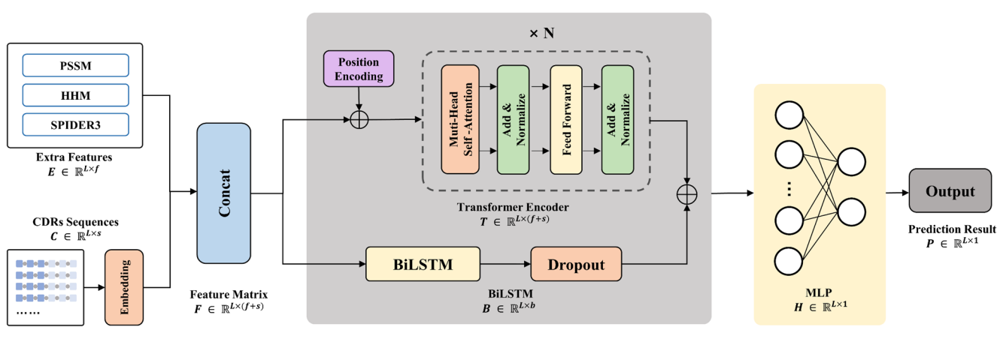

# DeepANIS

Reimplementation of the DeepANIS model by using pytorch.

The original implementation could be referred at [DeepANIS](https://github.com/HideInDust/DeepANIS/).

The web server is freely available at [https://biomed.nscc-gz.cn/apps/DeepANIS](https://biomed.nscc-gz.cn/apps/DeepANIS).

The International Conference on Bioinformatics & Biomedicine paper could be refered at [DeepANIS: Predicting antibody paratope from concatenated CDR sequences by integrating bidirectional long-short-term memory and transformer neural networks](https://ieeexplore.ieee.org/abstract/document/9669631).



## Dependencies

+ biopython == 1.79
+ cuda == 10.2
+ cudnn == 7.6.5
+ einops == 0.4.0
+ numpy == 1.19.1
+ pandas == 1.1.0
+ python == 3.7.7
+ scikit-learn == 0.23.2
+ torch == 1.8.1
+ tqdm == 4.48.2

## Overview

To be finished.

*1. Statistics of the dataset.*

277 antibody/antigen complexes -> 277 concatenated CDR sequences.

*2. Performance comparision on various metrics*
|Method|AUPRC|AUROC|F1-Score|MCC|
|:---: |:---:| :---:| :---:| :---: |
|DeepANIS|0.706±0.005|0.888±0.002|0.694±0.002|0.574±0.004|
|DeepANIS-re-LSTM|0.746±0.046|0.922±0.012|0.718±0.040|0.637±0.043|
|DeepANIS-re-Transformer|-|-|-|-|
|DeepANIS-re-all|-|-|-|-|

## Running

To reproduce all the results, please follow these steps:

(1) Open the share link below, come to the `./DeepANIS/preprocess` folder and download all zip files, put them into the `./data/preprocess` and finally unpack all the zip files.

Baidu drive: 链接：https://pan.baidu.com/s/1Q5SzrLhOCtUaNHzSDhUGFA 提取码：1l4e 

*Note: The `./DeepANIS/source` folder also contains a zip file with all calculated pssm, hmm and predicted spider3 features, you can refer `./data/build_features.py` to regenerate all node features, which have been downloaded in (1).*

(2) Run:

`python dataset.py`

it will generate a pickle file in the `./data/preprocess` with the same dataset name, this pickle file contain 4 objects:

+ `names_list:` All protein names in the dataset.
+ `sequences_dict:` Unique protein names -> protein sequence.
+ `graphs_dict:` Unique protein names -> the tuple with node features and distance map.
+ `labels_dict:` Unique protein names -> label list.

(3) Run:

`python run.py --gpu <gpu id> --run_fold <fold_num>`

+ `<gpu id>` is the gpu id.
+ `<fold_num>` is the fold number, you must choose fold number from `[1, 2, 3, 4, 5, 6, 7, 8, 9, 10]` since the 10-fold cv.

Others parameters could be refered in the `run.py`.

After running the code, it will create a folder with the format `seed_<args.seed>` in the `./result/` folder, the folder will contain:

```
result/
└── seed_2021
    ├── DeepANIS_fold_10.ckpt
    ├── DeepANIS_fold_10.txt
    ├── DeepANIS_fold_1.ckpt
    ├── DeepANIS_fold_1.txt
    ├── DeepANIS_fold_2.ckpt
    ├── DeepANIS_fold_2.txt
    ├── DeepANIS_fold_3.ckpt
    ├── DeepANIS_fold_3.txt
    ├── DeepANIS_fold_4.ckpt
    ├── DeepANIS_fold_4.txt
    ├── DeepANIS_fold_5.ckpt
    ├── DeepANIS_fold_5.txt
    ├── DeepANIS_fold_6.ckpt
    ├── DeepANIS_fold_6.txt
    ├── DeepANIS_fold_7.ckpt
    ├── DeepANIS_fold_7.txt
    ├── DeepANIS_fold_8.ckpt
    ├── DeepANIS_fold_8.txt
    ├── DeepANIS_fold_9.ckpt
    ├── DeepANIS_fold_9.txt
    ├── train_fold_10.txt
    ├── train_fold_1.txt
    ├── train_fold_2.txt
    ├── train_fold_3.txt
    ├── train_fold_4.txt
    ├── train_fold_5.txt
    ├── train_fold_6.txt
    ├── train_fold_7.txt
    ├── train_fold_8.txt
    ├── train_fold_9.txt
    ├── valid_fold_10.txt
    ├── valid_fold_1.txt
    ├── valid_fold_2.txt
    ├── valid_fold_3.txt
    ├── valid_fold_4.txt
    ├── valid_fold_5.txt
    ├── valid_fold_6.txt
    ├── valid_fold_7.txt
    ├── valid_fold_8.txt
    └── valid_fold_9.txt

```

## Citation:

Please cite the following paper if you use this code in your work.
```bibtex
@inproceedings{zhang2021deepanis,
  title={DeepANIS: Predicting antibody paratope from concatenated CDR sequences by integrating bidirectional long-short-term memory and transformer neural networks},
  author={Zhang, Pan and Zheng, Shuangjia and Chen, Jianwen and Zhou, Yaoqi and Yang, Yuedong},
  booktitle={2021 IEEE International Conference on Bioinformatics and Biomedicine (BIBM)},
  pages={118--124},
  year={2021},
  organization={IEEE}
}
```


