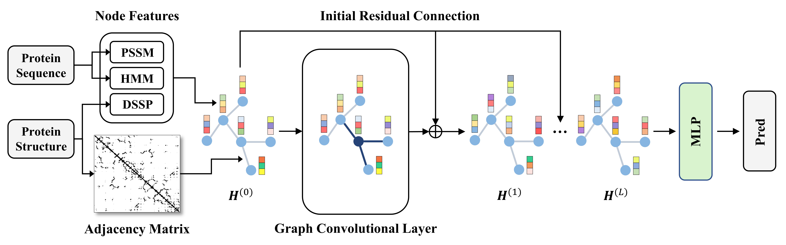

# GraphPPIS-dgl

Reimplementation of the GraphPPIS model by using dgl.

The original implementation could be referred at [GraphPPIS](https://github.com/yuanqm55/GraphPPIS) and [GraphPPIS-web](https://github.com/biomed-AI/GraphPPIS).

The web server is freely available at [https://biomed.nscc-gz.cn/apps/GraphPPIS](https://biomed.nscc-gz.cn/apps/GraphPPIS).

The Bioinformatics paper could be refered at [Structure-aware protein–protein interaction site prediction using deep graph convolutional network](https://doi.org/10.1093/bioinformatics/btab643).



## Dependencies
+ cuda == 10.2
+ cudnn == 7.6.5
+ dgl-cu10.2 == 0.7.2
+ numpy == 1.19.1
+ pandas == 1.1.0
+ python == 3.7.7
+ scikit-learn == 0.23.2
+ torch == 1.8.1
+ tqdm == 4.48.2

## Overview

*1. Statistics of the three benchmark datasets along with the training and test sets used in this study*

|Dataset|Interacting residues|Non-interacting residues|% of interacting residues|
|:---:  |:---:               |:---:                   |:---:                    |
|Dset_186|5517|30702|15.23|
|Dset_72 |1923|16217|10.60|
|Dset_164|6096|27585|18.10|
|Train_335|10374|55992|15.63|
|Test_60 |2075|11069|15.79|
|Test_315|9355|55976|14.32|
|UBtest_31|841|5813 |12.64|

*2. Performance comparision on AUROC*
|Method|5-fold CV|Test_315|Test_60|Btest_31|UBTest_31|
|:---: |:---:| :---:| :---:| :---:| :---: |
|GraphPPIS    |0.783±0.002|0.790|0.786|0.780|0.750|
|GraphPPIS-dgl|0.771±0.012|0.800|0.781|0.795|0.757|

*3. Performance comparision on AUPRC*
|Method|5-fold CV|Test_315|Test_60|Btest_31|UBTest_31|
|:---: |:---:| :---:| :---:| :---:| :---: |
|GraphPPIS    |0.423±0.003|0.423|0.429|0.395|0.323|
|GraphPPIS-dgl|0.410±0.024|0.418|0.421|0.389|0.300|

*4. Performance comparision on MCC*
|Method|5-fold CV|Test_315|Test_60|Btest_31|UBTest_31|
|:---: |:---:| :---:| :---:| :---:| :---: |
|GraphPPIS    |0.324±0.011|0.336|0.333|0.328|0.280|
|GraphPPIS-dgl|0.310±0.020|0.335|0.324|0.326|0.284|

*Note*

*(1) Since the small size of samples, performance will fluctuate 1 to 2 points in each dataset, especially in the BTest31 and UBTest31 dataset.*

*(2) The model may need to more works on tuning the hyper-parameters or other tricks.*

## Running

To reproduce all the results, please follow these steps:

(1) Open the share link below, go to the `./GraphPPIS` folder and download all zip files(about 100MB), put them into the `./data/preprocess` and finally unpack all the zip files.

Baidu drive: 链接：https://pan.baidu.com/s/1Q5SzrLhOCtUaNHzSDhUGFA 提取码：1l4e 

Google drive: [Link](https://drive.google.com/drive/folders/1sCi6KAMnIg4iaRD3yZxo58_fwBaqFSWT?usp=sharing)

(2) Run:

`python dataset.py`

it will generate a pickle file in the `./data/preprocess` with the same dataset name, this pickle file contain 4 objects:

+ `names_list:` All protein names in the dataset.
+ `sequences_dict:` Unique protein names -> protein sequence.
+ `graphs_dict:` Unique protein names -> dgl graph object.
+ `labels_dict:` Unique protein names -> label list.

(3) Run:

`python train.py --gpu <gpu id> --run_fold <fold_num>`

+ `<gpu id>` is the gpu id.
+ `<fold_num>` is the fold number, you must choose fold number from `[1, 2, 3, 4, 5]` since the 5-fold cv.

Others parameters could be refered in the `train.py`.

(4) Run:

`python test.py --gpu <gpu id> --run_fold <fold_num>`

+ `<gpu id>` is the gpu id.
+ `<fold_num>` is the fold number, you can choose fold number from `[1, 2, 3, 4, 5]` since the 5-fold cv, also you can use default fold number `0`, and it will make an ensemble prediction for all 5 folds.

After running the code, it will create a folder with the format `seed_<args.seed>` in the `./result/` folder, the folder will contain:

```
result/
└── seed_2021
    ├── GraphPPIS_Btest_31.csv
    ├── GraphPPIS_Btest_31.txt
    ├── GraphPPIS_fold_1.ckpt
    ├── GraphPPIS_fold_1.txt
    ├── GraphPPIS_fold_2.ckpt
    ├── GraphPPIS_fold_2.txt
    ├── GraphPPIS_fold_3.ckpt
    ├── GraphPPIS_fold_3.txt
    ├── GraphPPIS_fold_4.ckpt
    ├── GraphPPIS_fold_4.txt
    ├── GraphPPIS_fold_5.ckpt
    ├── GraphPPIS_fold_5.txt
    ├── GraphPPIS_Test_315.csv
    ├── GraphPPIS_Test_315.txt
    ├── GraphPPIS_Test_60.csv
    ├── GraphPPIS_Test_60.txt
    ├── GraphPPIS_UBtest_31.csv
    ├── GraphPPIS_UBtest_31.txt
    ├── train_fold_1.txt
    ├── train_fold_2.txt
    ├── train_fold_3.txt
    ├── train_fold_4.txt
    ├── train_fold_5.txt
    ├── valid_fold_1.txt
    ├── valid_fold_2.txt
    ├── valid_fold_3.txt
    ├── valid_fold_4.txt
    └── valid_fold_5.txt
```

+ `train_fold_*.txt` is the name of train dataset.
+ `valid_fold_*.txt` is the name of validation dataset.
+ `GraphPPIS_fold_*.txt/ckpt` is the train log / model of each fold.
+ `GraphPPIS_<dataset_name>.txt/csv` is the test dataset performance and its corresponding predictions.

## Citation:

Please cite the following paper if you use this code in your work.
```bibtex
@article{10.1093/bioinformatics/btab643,
    author = {Yuan, Qianmu and Chen, Jianwen and Zhao, Huiying and Zhou, Yaoqi and Yang, Yuedong},
    title = "{Structure-aware protein–protein interaction site prediction using deep graph convolutional network}",
    journal = {Bioinformatics},
    volume = {38},
    number = {1},
    pages = {125-132},
    year = {2021},
    month = {09},
    issn = {1367-4803},
    doi = {10.1093/bioinformatics/btab643},
    url = {https://doi.org/10.1093/bioinformatics/btab643},
    eprint = {https://academic.oup.com/bioinformatics/article-pdf/38/1/125/41890956/btab643.pdf},
}
```

