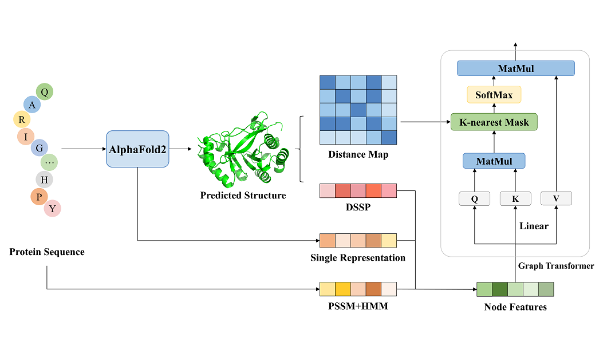

# GraphSite

Reimplementation of the GraphSite model by using pytorch.

The original implementation could be referred at [GraphSite](https://github.com/biomed-AI/GraphSite).

The web server is freely available at [https://biomed.nscc-gz.cn/apps/GraphSite](https://biomed.nscc-gz.cn/apps/GraphSite).

The Briefings in Bioinformatics paper could be refered at [AlphaFold2-aware protein–DNA binding site prediction using graph transformer](https://doi.org/10.1093/bib/bbab564).



## Dependencies
+ cuda == 10.2
+ cudnn == 7.6.5
+ einops == 0.4.0
+ numpy == 1.19.1
+ pandas == 1.1.0
+ python == 3.7.7
+ scikit-learn == 0.23.2
+ torch == 1.8.1
+ tqdm == 4.48.2

## Overview

*1. Statistics of the three benchmark datasets along with the training and test sets used in this study*

|Dataset|Binding residues|Non-binding residues|% of binding residues|
|:---:  |:---:               |:---:                   |:---:        |
|Train_573|14479|145404|9,06|
|Test_129 |2240|35275|5.97|
|Test_181|3208|72050|4.26|

*2. Performance comparision on AUROC*
|Method|5-fold CV|Test_129|Test_181|
|:---: |:---:| :---:| :---:|
|GraphSite|0.915±0.001|0.934|0.917|
|GraphSite-re|0.921±0.005|0.933|0.910|

*3. Performance comparision on AUPRC*
|Method|5-fold CV|Test_129|Test_181|
|:---: |:---:| :---:| :---:|
|GraphSite|0.589±0.003|0.544|0.369|
|GraphSite-re|0.602±0.027|0.530|0.359|

## Running

To reproduce all the results, please follow these steps:

(1) Open the share link below, come to the `./GraphSite/preprocess` folder and download all zip files(about 700MB), put them into the `./data/preprocess` and finally unpack all the zip files.

Baidu drive: 链接：https://pan.baidu.com/s/1Q5SzrLhOCtUaNHzSDhUGFA 提取码：1l4e 

Google drive: [Link](https://drive.google.com/drive/folders/1sCi6KAMnIg4iaRD3yZxo58_fwBaqFSWT?usp=sharing)

*Note: The `./GraphSite/source` folder also contains a zip file with all Alphafold2 predicted structure and their corresponding distance map between residues, you can refer `./data/build_features.py` to regenerate all node features and edge features, which have been downloaded in (1).*

(2) Run:

`python dataset.py`

it will generate a pickle file in the `./data/preprocess` with the same dataset name, this pickle file contain 4 objects:

+ `names_list:` All protein names in the dataset.
+ `sequences_dict:` Unique protein names -> protein sequence.
+ `graphs_dict:` Unique protein names -> the tuple with node features and distance map.
+ `labels_dict:` Unique protein names -> label list.

(3) Run:

`python train.py --gpu <gpu id> --run_fold <fold_num>`

+ `<gpu id>` is the gpu id.
+ `<fold_num>` is the fold number, you must choose fold number from `[1, 2, 3, 4, 5]` since the 5-fold cv.

Others parameters could be refered in the `train.py`.

(4) Run:

`python test.py --gpu <gpu id> --run_fold <fold_num>`

+ `<gpu id>` is the gpu id.
+ `<fold_num>` is the fold number, you can choose fold number from `[1, 2, 3, 4, 5]` since the 5-fold cv, also you can use default fold number `0`, and it will make an ensemble prediction for all 5 folds.

After running the code, it will create a folder with the format `seed_<args.seed>` in the `./result/` folder, the folder will contain:

```
result/
└── seed_2021
    ├── GraphSite_fold_1.ckpt
    ├── GraphSite_fold_1.txt
    ├── GraphSite_fold_2.ckpt
    ├── GraphSite_fold_2.txt
    ├── GraphSite_fold_3.ckpt
    ├── GraphSite_fold_3.txt
    ├── GraphSite_fold_4.ckpt
    ├── GraphSite_fold_4.txt
    ├── GraphSite_fold_5.ckpt
    ├── GraphSite_fold_5.txt
    ├── GraphSite_test_129.csv
    ├── GraphSite_test_129.txt
    ├── GraphSite_test_181.csv
    ├── GraphSite_test_181.txt
    ├── train_fold_1.txt
    ├── train_fold_2.txt
    ├── train_fold_3.txt
    ├── train_fold_4.txt
    ├── train_fold_5.txt
    ├── valid_fold_1.txt
    ├── valid_fold_2.txt
    ├── valid_fold_3.txt
    ├── valid_fold_4.txt
    └── valid_fold_5.txt
```

+ `train_fold_*.txt` is the name of train dataset.
+ `valid_fold_*.txt` is the name of validation dataset.
+ `GraphPPIS_fold_*.txt/ckpt` is the train log / model of each fold.
+ `GraphPPIS_<dataset_name>.txt/csv` is the test dataset performance and its corresponding predictions.

## Citation:

Please cite the following paper if you use this code in your work.
```bibtex
@article{10.1093/bib/bbab564,
    author = {Yuan, Qianmu and Chen, Sheng and Rao, Jiahua and Zheng, Shuangjia and Zhao, Huiying and Yang, Yuedong},
    title = "{AlphaFold2-aware protein–DNA binding site prediction using graph transformer}",
    journal = {Briefings in Bioinformatics},
    year = {2022},
    month = {01},
    issn = {1477-4054},
    doi = {10.1093/bib/bbab564},
    url = {https://doi.org/10.1093/bib/bbab564},
    note = {bbab564},
    eprint = {https://academic.oup.com/bib/advance-article-pdf/doi/10.1093/bib/bbab564/42221878/bbab564.pdf},
}
```

