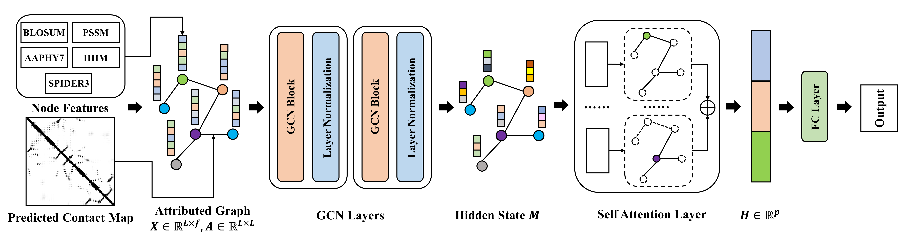

# GraphSol-dgl

Reimplementation of the GraphSol model by using dgl.

The original implementation could be referred at [GraphSol](https://github.com/jcchan23/GraphSol).

The web server is freely available at [https://biomed.nscc-gz.cn/apps/GraphSol](https://biomed.nscc-gz.cn/apps/GraphSol).

The Journal of Cheminfomatics paper could be refered at [Structure-aware protein solubility prediction from sequence through graph convolutional network and predicted contact map](https://jcheminf.biomedcentral.com/articles/10.1186/s13321-021-00488-1).



*Note: In the reimplementation, we add the dense connection for the GraphSol framework to improve the performance and the robustness.*

## Dependencies
+ cuda == 10.2
+ cudnn == 7.6.5
+ dgl-cu10.2 == 0.7.2
+ numpy == 1.19.1
+ pandas == 1.1.0
+ python == 3.7.7
+ scikit-learn == 0.23.2
+ scipy == 1.7.1
+ torch == 1.8.1
+ tqdm == 4.48.2

## Overview

*1. Statistics of the eSol datasets*

|Dataset|Total|
|:---:|:---:|
|esol_train|2364|
|esol_test|783|
|scerevisiae_test|108|


*2. Performance comparision on the eSol-train dataset with 5 folds cv*

|Models|R^2|
|:---:|:---:|
|5 folds CV|0.476±0.014|
|5 folds CV-dgl|0.432±0.061|

*3. Performance comparision on the eSol-test dataset* 

|Models|RMSE|R^2|Accuracy|Precision|Recall|F1|AUC
|:---:|:---:|:---:|:---:|:---:|:---:|:---:|:---:|
|LSTM|0.236|0.458|0.765|0.748|0.677|0.730|0.855|
|GraphSol(no contact)|0.235|0.462|0.763|0.710|0.676|0.729|0.853|
|GraphSol|0.231|0.483|0.779|0.775|0.693|0.732|0.866|
|GraphSol(ensemble)|0.227|0.501|0.782|0.790|0.702|0.743|0.873|
|GraphSol-dgl|0.229|0.488|0.785|0.775|0.735|0.775|0.867|
|GraphSol-dgl(ensemble)|0.226|0.502|0.790|0.783|0.739|0.760|0.872|

*4. Performance comparision on the S.cerevisiae dataset*

|Models|R^2|
|:---:|:---:|
|Solart|0.422|
|GraphSol-dgl(ensemble)|0.383|
|GraphSol-dgl|0.374|
|GraphSol(ensemble)|0.372|
|GraphSol|0.358|
|ccSol|0.302|
|Protein-Sol|0.281|
|CamSol|0.160|
|DeepSol|0.090|
|ProGAN|0.084|

*Notes:*

*(1) There may have a difference distribution between the eSol validation dataset and the eSol test dataset since the bigger standard deviation. However, the result on the 5 folds cv and the independent test are very stable.*

*(2) The performance on the S.cerevisiae dataset may use the square of pearson's correlation coefficient.*


## Running

To reproduce all the results, please follow these steps:

(1) Open the share link below, go to the `./GraphSol` folder and download all zip files(about 1GB), put them into the `./data/preprocess` and finally unpack all the zip files.

Baidu drive: 链接：https://pan.baidu.com/s/1Q5SzrLhOCtUaNHzSDhUGFA 提取码：1l4e 

(2) Run:

`python dataset_esol.py`

it will generate a pickle file in the `./data/preprocess` with the same dataset name, this pickle file contain 4 objects:

+ `names_list:` All protein names in the dataset.
+ `sequences_dict:` Unique protein names -> protein sequence.
+ `graphs_dict:` Unique protein names -> dgl graph object.
+ `labels_dict:` Unique protein names -> label list.

(3) Run:

`python train_esol.py --gpu <gpu id> --run_fold <fold_num>`

+ `<gpu id>` is the gpu id.
+ `<fold_num>` is the fold number, you must choose fold number from `[1, 2, 3, 4, 5]` since the 5-fold cv.

Others parameters could be refered in the `train_esol.py`.

(4) Run:

`python test_esol.py --gpu <gpu id> --run_fold <fold_num>`

+ `<gpu id>` is the gpu id.
+ `<fold_num>` is the fold number, you can choose fold number from `[1, 2, 3, 4, 5]` since the 5-fold cv, also you can use default fold number `0`, and it will make an ensemble prediction for all 5 folds.

After running the code, it will create a folder with the format `esol_seed_<args.seed>` in the `./result/` folder, the folder will contain:

```
result/
└── esol_seed_2021
    ├── GraphSol_esol.csv
    ├── GraphSol_esol_test.csv
    ├── GraphSol_esol_test.txt
    ├── GraphSol_esol.txt
    ├── GraphSol_fold_1.ckpt
    ├── GraphSol_fold_1.txt
    ├── GraphSol_fold_2.ckpt
    ├── GraphSol_fold_2.txt
    ├── GraphSol_fold_3.ckpt
    ├── GraphSol_fold_3.txt
    ├── GraphSol_fold_4.ckpt
    ├── GraphSol_fold_4.txt
    ├── GraphSol_fold_5.ckpt
    ├── GraphSol_fold_5.txt
    ├── GraphSol_scerevisiae.csv
    ├── GraphSol_scerevisiae.txt
    ├── train_fold_1.txt
    ├── train_fold_2.txt
    ├── train_fold_3.txt
    ├── train_fold_4.txt
    ├── train_fold_5.txt
    ├── valid_fold_1.txt
    ├── valid_fold_2.txt
    ├── valid_fold_3.txt
    ├── valid_fold_4.txt
    └── valid_fold_5.txt

```

+ `train_fold_*.txt` is the name of train dataset.
+ `valid_fold_*.txt` is the name of validation dataset.
+ `GraphSol_fold_*.txt/ckpt` is the train log / model of each fold.
+ `GraphSol_<dataset_name>.txt/csv` is the test dataset performance and its corresponding predictions.

## Citations
Please cite our paper if you want to use our code in your work.
```bibtex
@article{chen2021structure,
  title={Structure-aware protein solubility prediction from sequence through graph convolutional network and predicted contact map},
  author={Chen, Jianwen and Zheng, Shuangjia and Zhao, Huiying and Yang, Yuedong},
  journal={Journal of cheminformatics},
  volume={13},
  number={1},
  pages={1--10},
  year={2021},
  publisher={Springer}
}