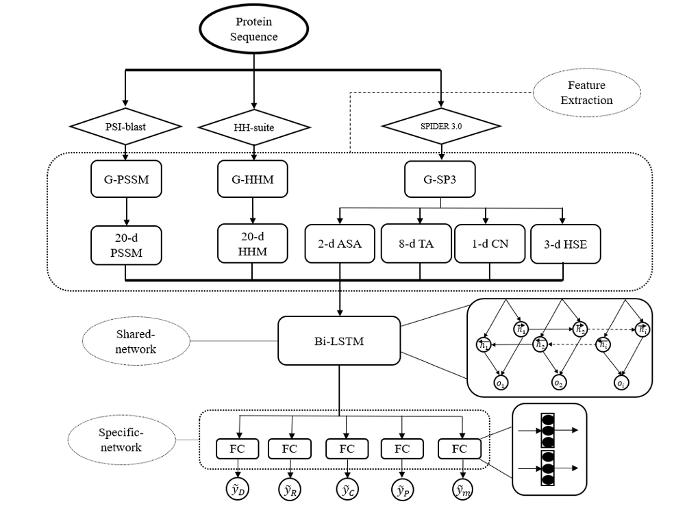

# MTDSite

Reimplementation of the MTDSite model by using pytorch.

The original implementation could be referred at [MTDSite](https://github.com/biomed-AI/MTDsite).

The web server is freely available at [http://biomed.nscc-gz.cn/server/MTDsite/](http://biomed.nscc-gz.cn/server/MTDsite/).

The Bioinformatics paper could be refered at [To improve the predictions of binding residues with DNA, RNA, carbohydrate, and peptide via multiple-task deep neural networks](https://ieeexplore.ieee.org/document/9568737).



## Dependencies
+ cuda == 10.2
+ cudnn == 7.6.5
+ numpy == 1.19.1
+ pandas == 1.1.0
+ python == 3.7.7
+ scikit-learn == 0.23.2
+ torch == 1.8.1
+ tqdm == 4.48.2

## Overview

*1. Statistics of the three benchmark datasets along with the training and test sets used in this study.*

|Dataset|Number of Chains|Binding Sites|Non-Binding Sites|
|:---:  |:---:           |:---:       |:---:           |
|Carbohydrate-Train|100|1028|25958|
|Carbohydrate-Test |49 |508 |13230|
|DNA-Train|309|6832|58270|
|DNA-Test |47 |875 |8231 |
|Peptide-Train|1113|14953|251708|
|Peptide-Test |124 |1716 |29154 |
|RNA-Train|157|4627|30052|
|RNA-Test |17 |409 |5448 |

*2. Performance comparision of cv and test dataset by using various metrics.*
|Method(10-fold)|AUROC|MCC|Sensitive|Specificity
|:---: |:---:| :---:| :---:| :---:|
|Carbohydrate-CV  |0.779 (0.804)|0.276 (0.253)|0.428 (0.371)|0.957 (0.945)|
|Carbohydrate-Test|0.776 (0.770)|0.255 (0.214)|0.414 (0.335)|0.954 (0.945)|
|DNA-CV           |0.866 (0.883)|0.401 (0.467)|0.691 (0.575)|0.877 (0.929)|
|DNA-Test         |0.852 (0.857)|0.397 (0.399)|0.684 (0.533)|0.873 (0.923)|
|Peptide-CV       |0.760 (0.782)|0.304 (0.258)|0.346 (0.338)|0.956 (0.946)|
|Peptide-Test     |0.758 (0.792)|0.299 (0.280)|0.344 (0.311)|0.953 (0.962)|
|RNA-CV           |0.857 (0.833)|0.369 (0.421)|0.635 (0.558)|0.936 (0.899)|
|RNA-Test         |0.836 (0.777)|0.361 (0.293)|0.612 (0.357)|0.932 (0.949)|

*3. Performance comparision of four test dataset by using AUROC with different training dataset.*
|Models|Carbohydrate|DNA|Peptide|RNA|
|:---: |:---:| :---:| :---:| :---:|
|Carbohydrate|0.746 (0.770)|0.632 (0.696)|0.552 (0.583)|0.614 (0.694)|
|DNA         |0.718 (0.738)|0.822 (0.856)|0.601 (0.602)|0.801 (0.804)|
|Peptide     |0.510 (0.753)|0.531 (0.732)|0.734 (0.792)|0.520 (0.782)|
|RNA         |0.709 (0.682)|0.801 (0.822)|0.600 (0.596)|0.810 (0.777)|
|Mix         |0.776 (0.787)|0.852 (0.864)|0.758 (0.788)|0.836 (0.850)|

*Note*

*(1) The number inside the brackets and outside the brackets are our reimplementation of MTDSites and the reported performance in the paper, respectively.*

*(2) Performance reported in the table 2 and 3 are both trained on the single training dataset except the last line marked "Mix" in the table 3. "Mix" line means the MTDSite model are trained on four training dataset and then evaulated on each test dataset.*

*(3) The paper used AUROC as the main metric since it doesn't rely on the selected threshold, and thus you can both see the better performance and worse performance in the reimplementation.*

*(4) According to the experience from GraphPPIS, the performance will meet a 1~2 point fluctuation since the small number of the test dataset.*

## Running

To reproduce all the results, please follow these steps:

(1) Open the share link below, go to the `./MTDSite` folder and download all zip files(about 100MB), put them into the `./data/source` and finally unpack all the zip files.

Baidu drive: 链接：https://pan.baidu.com/s/1Q5SzrLhOCtUaNHzSDhUGFA 提取码：1l4e 

(2) Run:

`python dataset.py`

it will generate a pickle file in the `./data/preprocess` with the same dataset name, this pickle file contain 4 objects:

+ `names_list:` All protein names in the dataset.
+ `sequences_dict:` Unique protein names -> protein sequence.
+ `graphs_dict:` Unique protein names -> dgl graph object.
+ `labels_dict:` Unique protein names -> label list.

(3) Run:

`python train.py --gpu <gpu id> --run_fold <fold_num> --data_name <dataset_name>`

+ `<gpu id>` is the gpu id.
+ `<fold_num>` is the fold number, you must choose fold number from `[1, 2, 3, 4, 5, 6, 7, 8, 9, 10]` since the 10-fold cv.
+ `<dataset_name>` is the dataset name, you must choose a dataset name in `['carbohydrate', 'dna', 'peptide', 'rna', 'mix']` and `mix` means use the sum of all four training dataset.

Others parameters could be refered in the `train.py`.

(4) Run:

`python test.py --gpu <gpu id> --run_fold <fold_num> --data_name <dataset_name>`

+ `<gpu id>` is the gpu id.
+ `<fold_num>` is the fold number, you can choose fold number from `[1, 2, 3, 4, 5, 6, 7, 8, 9, 10]` since the 10-fold cv, also you can use default fold number `0`, and it will make an ensemble prediction for all 10 folds.
+ `<dataset_name>` is the dataset name, you must choose a dataset name in `['carbohydrate', 'dna', 'peptide', 'rna', 'mix']`, which means use the corresponding pretrained model to test other four test dataset.

After running the code, it will create a folder with the format `<dataset_name>_seed_<args.seed>` in the `./result/` folder, the folder will contain:

```
result/
├── carbohydrate_seed_2021
├── dna_seed_2021
├── mix_seed_2021
├── peptide_seed_2021
└── rna_seed_2021
```
```
result/carbohydrate_seed_2021/
├── MTDSite_carbohydrate.csv
├── MTDSite_carbohydrate.txt
├── MTDSite_dna.csv
├── MTDSite_dna.txt
├── MTDSite_fold_10.ckpt
├── MTDSite_fold_10.txt
├── MTDSite_fold_1.ckpt
├── MTDSite_fold_1.txt
├── MTDSite_fold_2.ckpt
├── MTDSite_fold_2.txt
├── MTDSite_fold_3.ckpt
├── MTDSite_fold_3.txt
├── MTDSite_fold_4.ckpt
├── MTDSite_fold_4.txt
├── MTDSite_fold_5.ckpt
├── MTDSite_fold_5.txt
├── MTDSite_fold_6.ckpt
├── MTDSite_fold_6.txt
├── MTDSite_fold_7.ckpt
├── MTDSite_fold_7.txt
├── MTDSite_fold_8.ckpt
├── MTDSite_fold_8.txt
├── MTDSite_fold_9.ckpt
├── MTDSite_fold_9.txt
├── MTDSite_peptide.csv
├── MTDSite_peptide.txt
├── MTDSite_rna.csv
├── MTDSite_rna.txt
├── train_fold_10.txt
├── train_fold_1.txt
├── train_fold_2.txt
├── train_fold_3.txt
├── train_fold_4.txt
├── train_fold_5.txt
├── train_fold_6.txt
├── train_fold_7.txt
├── train_fold_8.txt
├── train_fold_9.txt
├── valid_fold_10.txt
├── valid_fold_1.txt
├── valid_fold_2.txt
├── valid_fold_3.txt
├── valid_fold_4.txt
├── valid_fold_5.txt
├── valid_fold_6.txt
├── valid_fold_7.txt
├── valid_fold_8.txt
└── valid_fold_9.txt
```

+ `train_fold_*.txt` is the name of train dataset.
+ `valid_fold_*.txt` is the name of validation dataset.
+ `MTDSite_fold_*.txt/ckpt` is the train log / model of each fold.
+ `MTDSite_<dataset_name>.txt/csv` is the test dataset performance and its corresponding predictions.

## Citation:

Please cite the following paper if you use this code in your work.
```bibtex
@ARTICLE{9568737,
  author={Sun, Zhe and Zheng, Shuangjia and Zhao, Huiying and Niu, Zhangming and Lu, Yutong and Pan, Yi and Yang, Yuedong},
  journal={IEEE/ACM Transactions on Computational Biology and Bioinformatics}, 
  title={To improve the predictions of binding residues with DNA, RNA, carbohydrate, and peptide via multi-task deep neural networks}, 
  year={2021},
  volume={},
  number={},
  pages={1-1},
  doi={10.1109/TCBB.2021.3118916}
}
```

