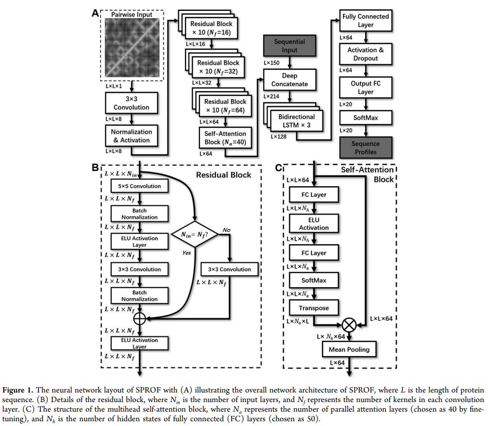

# SPROF-dgl

Reimplementation of the SPROF model by using dgl.

The original implementation could be referred at [SPROF](https://github.com/sysucs/SPROF).

The journal of chemical information and modeling paper could be refered at [To Improve Protein Sequence Profile Prediction through Image Captioning on Pairwise Residue Distance Map](https://pubs.acs.org/doi/10.1021/acs.jcim.9b00438).



*Notes: since the train process will cost a lot of time (24 hours in training all 5 folds when using spin2 dataset) in the original implementation, I use the protein features in this paper(Structual-based node features and 2D distance map) and implement a single 3 layers DenseGCN.*

## Dependencies
+ cuda == 10.2
+ cudnn == 7.6.5
+ dgl-cu10.2 == 0.7.2
+ numpy == 1.19.1
+ pandas == 1.1.0
+ python == 3.7.7
+ scikit-learn == 0.23.2
+ torch == 1.8.1
+ tqdm == 4.48.2

## Overview

*1. Statistics of the two benchmark datasets along with the train and test datasets used in this study*

|Dataset|Number of chains|
|:---:  |:---:|         
|spin2-train|7134|
|spin2-test|922|
|spin2-casp|22|
|densecpd-train|13626|
|t500|685|
|ts50|48|

*2. Performance comparision on the sequence recovery rate in spin2 dataset.*
|Method|5-fold CV|Test|CASP|
|:---: |:---:| :---:| :---:|
|DenseGCN|0.437±0.002|0.430|0.433|
|SPROF|0.399±0.003|0.398|0.392|
|SPIN2|0.346±0.002|0.346|0.346|

*3. Performance comparision on the sequence recovery rate in densecpd dataset.*
|Method|5-fold CV|t500|ts50|
|:---: |:---:| :---:|:---:|
|DenseGCN|0.449±0.002|0.455|0.441|
|DenseCPD|0.532±0.017|0.555|0.507|
|GVP-GNN|-|-|0.449|
|ProDCoNN|-|0.422|0.407|
|SPROF|-|0.402|0.392|
|SPIN2|-|0.366|0.336|
|Wang’s Model|0.340±0.001|0.361|0.330|
|ProteinSolver|-|-|0.308|
|SPIN|-|0.303|0.303|
|Rosetta|-|-|0.300|

*Note:*

*(1) According to the paper of GVP-GNN, The main difference between the ProDCoNN and the DenseCPD is that ProDCoNN has 4 three-dimension convolutional layers and DenseCPD has 21 layers organized into dense residual blocks. Our DenseGCN model consists of 3 layers of Graph Convolutional Layers with dense residual blocks.*

*(2) DenseGCN could run fastly than SPROF with 13s per epoch and could run all folds in parallel.*

## Running

To reproduce all the results, please follow these steps:

(1) Open the share link below, come to the `./SPROF` folder and download all zip files(about 4GB for `densecpd.zip` and 2.2GB for `spin2.zip`), put them into the `./data/preprocess` and finally unpack all the zip files.

Baidu drive: 链接：https://pan.baidu.com/s/1Q5SzrLhOCtUaNHzSDhUGFA 提取码：1l4e 

(2) Run:

`python dataset.py`

it will generate a pickle file in the `./data/preprocess` with the same dataset name, this pickle file contain 4 objects:

+ `names_list:` All protein names in the dataset.
+ `sequences_dict:` Unique protein names -> protein sequence.
+ `graphs_dict:` Unique protein names -> dgl graph object.
+ `labels_dict:` Unique protein names -> label list.

(3) Run:

`python train_<spin2>/<densecpd>.py --gpu <gpu id> --run_fold <fold_num>`

+ `<gpu id>` is the gpu id.
+ `<fold_num>` is the fold number, you must choose fold number from `[1, 2, 3, 4, 5]` since the 5-fold cv.

Others parameters could be refered in the `train.py`.

(4) Run:

`python test_<spin2>/<densecpd>.py --gpu <gpu id> --run_fold <fold_num>`

+ `<gpu id>` is the gpu id.
+ `<fold_num>` is the fold number, you can choose fold number from `[1, 2, 3, 4, 5]` since the 5-fold cv, also you can use default fold number `0`, and it will make an ensemble prediction for all 5 folds.

After running the code, it will create a folder with the format `<spin2>/<densecpd>_seed_<args.seed>` in the `./result/` folder, the folder will contain:

```
result/
├── densecpd_seed_2021
│   ├── DenseGCN_fold_1.ckpt
│   ├── DenseGCN_fold_1.txt
│   ├── DenseGCN_fold_2.ckpt
│   ├── DenseGCN_fold_2.txt
│   ├── DenseGCN_fold_3.ckpt
│   ├── DenseGCN_fold_3.txt
│   ├── DenseGCN_fold_4.ckpt
│   ├── DenseGCN_fold_4.txt
│   ├── DenseGCN_fold_5.ckpt
│   ├── DenseGCN_fold_5.txt
│   ├── DenseGCN_t500.csv
│   ├── DenseGCN_t500.txt
│   ├── DenseGCN_ts50.csv
│   ├── DenseGCN_ts50.txt
│   ├── train_fold_1.txt
│   ├── train_fold_2.txt
│   ├── train_fold_3.txt
│   ├── train_fold_4.txt
│   ├── train_fold_5.txt
│   ├── valid_fold_1.txt
│   ├── valid_fold_2.txt
│   ├── valid_fold_3.txt
│   ├── valid_fold_4.txt
│   └── valid_fold_5.txt
├── result store here.txt
└── spin2_seed_2021
    ├── DenseGCN_casp.csv
    ├── DenseGCN_casp.txt
    ├── DenseGCN_fold_1.ckpt
    ├── DenseGCN_fold_1.txt
    ├── DenseGCN_fold_2.ckpt
    ├── DenseGCN_fold_2.txt
    ├── DenseGCN_fold_3.ckpt
    ├── DenseGCN_fold_3.txt
    ├── DenseGCN_fold_4.ckpt
    ├── DenseGCN_fold_4.txt
    ├── DenseGCN_fold_5.ckpt
    ├── DenseGCN_fold_5.txt
    ├── DenseGCN_test.csv
    ├── DenseGCN_test.txt
    ├── train_fold_1.txt
    ├── train_fold_2.txt
    ├── train_fold_3.txt
    ├── train_fold_4.txt
    ├── train_fold_5.txt
    ├── valid_fold_1.txt
    ├── valid_fold_2.txt
    ├── valid_fold_3.txt
    ├── valid_fold_4.txt
    └── valid_fold_5.txt

```

+ `train_fold_*.txt` is the name of train dataset.
+ `valid_fold_*.txt` is the name of validation dataset.
+ `DenseGCN_fold_*.txt/ckpt` is the train log / model of each fold.
+ `DenseGCN_<dataset_name>.txt/csv` is the test dataset performance and its corresponding predictions.

## Citation:

Please cite the following paper if you use this code in your work.
```bibtex
@article{chen2019improve,
  title={To improve protein sequence profile prediction through image captioning on pairwise residue distance map},
  author={Chen, Sheng and Sun, Zhe and Lin, Lihua and Liu, Zifeng and Liu, Xun and Chong, Yutian and Lu, Yutong and Zhao, Huiying and Yang, Yuedong},
  journal={Journal of chemical information and modeling},
  volume={60},
  number={1},
  pages={391--399},
  year={2019},
  publisher={ACS Publications}
}
```

